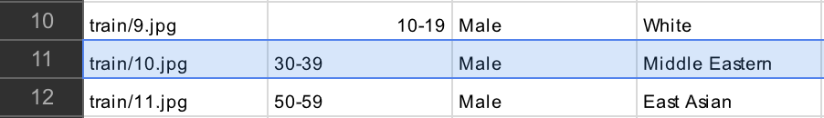
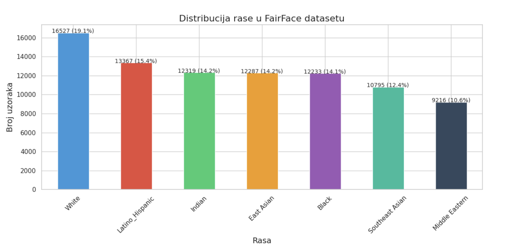
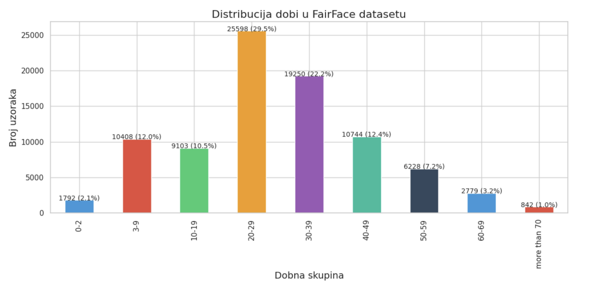
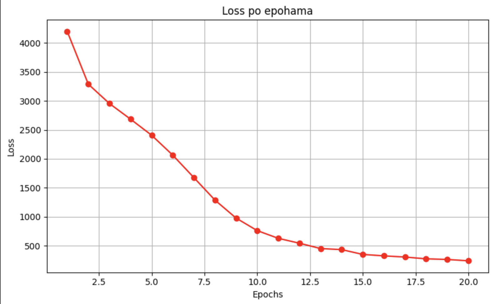
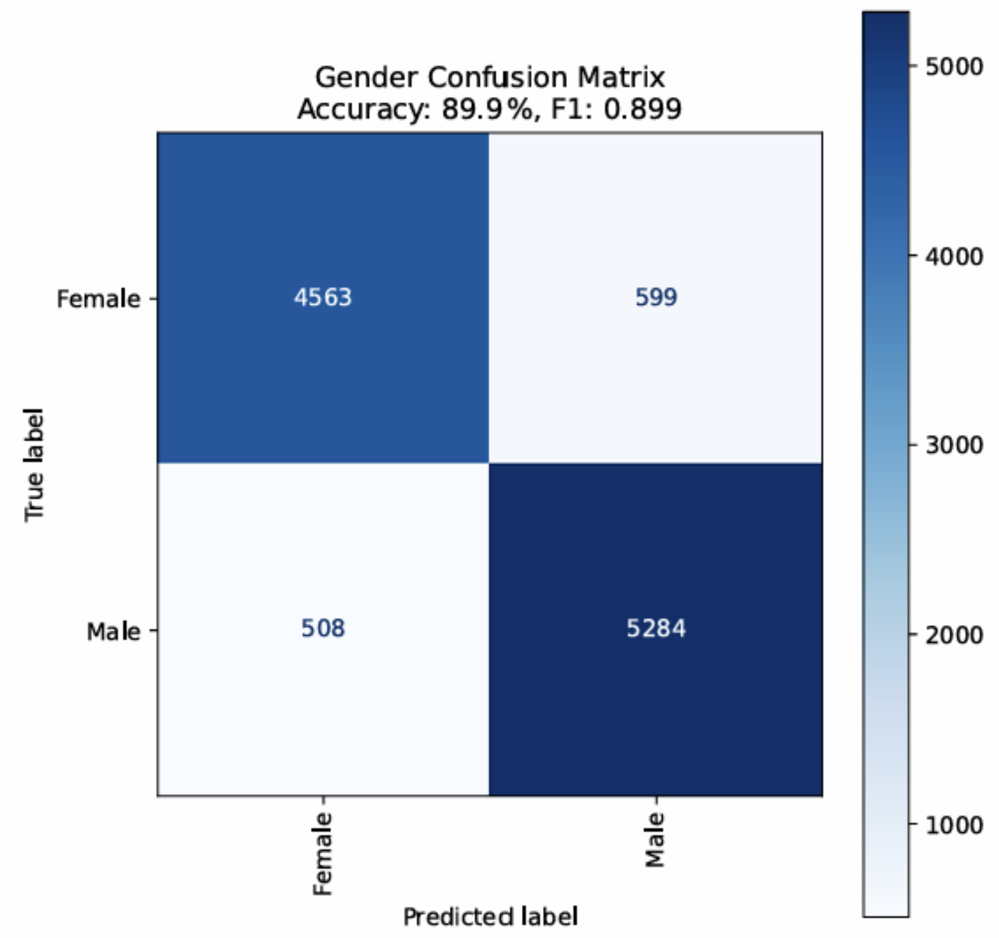
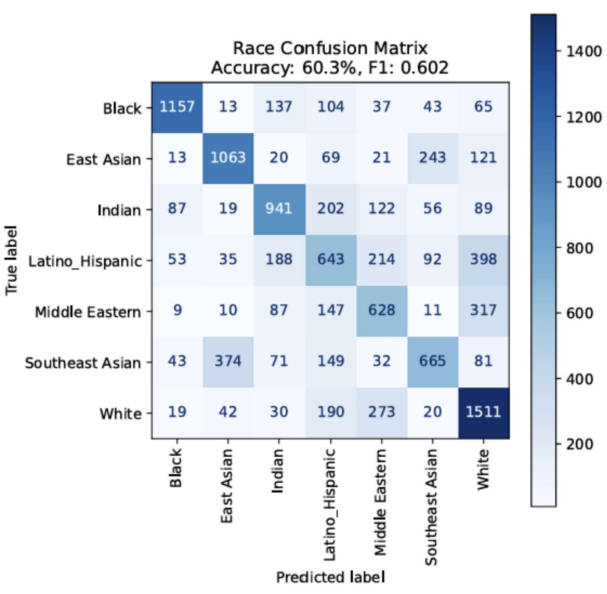
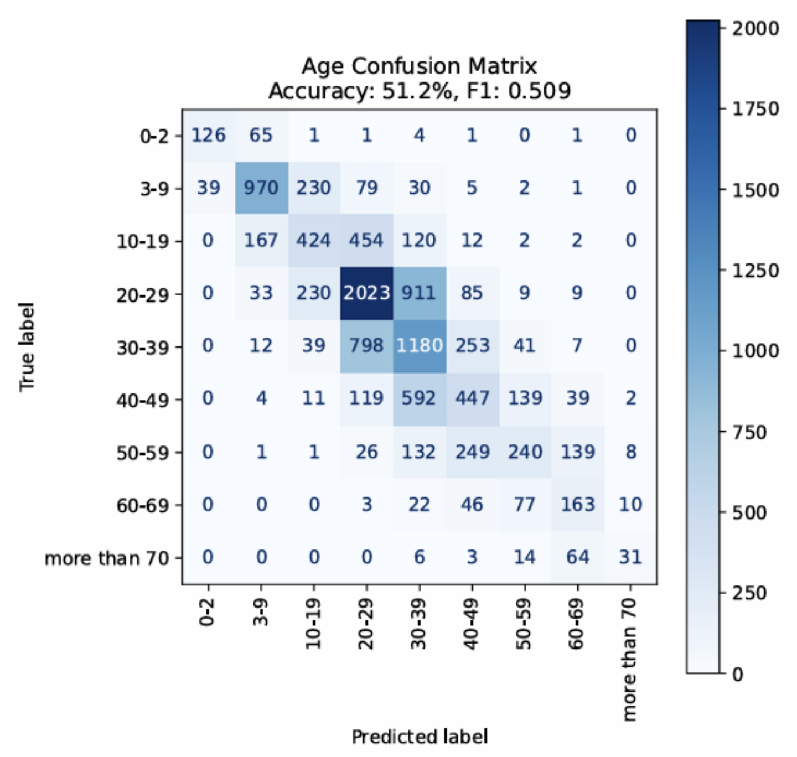

# **Estimation of Sociobiological Characteristics Based on Facial Images**

# **Authors:** , , 

**University of Sarajevo**  
**Faculty of Electrical Engineering Sarajevo**  
**Department of Computer Science and Informatics**  
*Artificial Intelligence – Academic Year 2024/2025*

## **All Project Files and Detailed Documentation:** 
## **Video Presentation for Project:** 

---

## **Technologies and Libraries Used**

These tools were selected based on their effectiveness in handling deep learning workflows, data preprocessing, and collaborative experimentation:

 **Python**: Chosen for its simplicity and rich ecosystem in machine learning and data science.  
 **PyTorch**: Used for building and training deep learning models with flexibility and ease of debugging.  
 **Google Colab**: Provided free GPU access and a collaborative environment for running experiments.  
 **Pandas**: Used for efficient manipulation, analysis, and inspection of the dataset prior to modeling.  

  &nbsp;&nbsp;
  &nbsp;&nbsp;
  &nbsp;&nbsp;
  

---

## **1. Problem Overview**

With the rise of AI, analyzing facial images to estimate sociobiological traits (race, gender, age) has grown in relevance. This task poses both technical and ethical challenges due to genetic diversity, ambiguous group definitions, biased datasets, and the risk of reinforcing social stereotypes.

### **Applications**
- Demographics, UI personalization, forensics, marketing, and healthcare.

---

## **2. State of the Art**

Recent progress in deep learning, particularly Convolutional Neural Networks (CNNs), has led to high accuracy in facial attribute estimation. Key methods include transfer learning and multi-task learning. Still, commercial systems often show significant bias.

### **Notable Studies**
- **Gender Shades**: Highlighted bias in commercial classifiers.
- **FairFace**: Introduced a balanced dataset to mitigate bias.

---

## [3. Dataset & Preprocessing](./src/analiza_dataset_a.py)

**Dataset**: FairFace (108k+ images) labeled by race (7 groups), gender (2), and age (9 groups). Split into train, validation, and test sets.

**Dataset Structure Example**:

   ->   train/10.jpg

  ---

**Balance Analysis**:
- Race: ~10–19% per group  
  
  ---
  
- Age: Broad distribution  
  
  ---

- Gender: 50/50
  --- 

**Preprocessing**:
- Resize to 224×224
- Tensor conversion & normalization (ImageNet stats)

## **More about dataset:** 

---

## [4. Model & Training](./src/kreiranje_i_treniranje_mreze.py)

**Architecture**: ResNet-34 (pretrained) with three heads for race, gender, and age (multi-task setup).

**Training**:
- Epochs: 20, Batch: 64, Optimizer: Adam (lr=0.0001)
- Subset of 65k images (due to Colab limits)

**Summed epoch loss (we used L = ∑ Li of all 65,000 training images) dropped** from ~4100 → ~250.

---

### ℹ️ Use of train-eval split missing due to Google Colab free tier limits and the first experience in use and experimenting with PyTorch

---

## [5. Evaluation Results](./src/pipeline_za_testiranje.py)

**Test Accuracy**:
- Gender: 89.9%  
  
  ---
- Race: 60.3%  
  
  ---
- Age: 51.2%  
  
  ---

**Insights**:
- Gender prediction: very accurate
- Race: confusions between similar-looking groups
- Age: most errors near true class

---

## **6. Evaluation & Ethics**

**Strengths**:
- Gender classification is robust
- Race and age predictions are reasonable
- Less biased than commercial tools due to dataset balance

**Limitations**:
- No validation set used
- Limited dataset due to runtime constraints

**Future Work**:
- Use full dataset
- Add validation with early stopping
- Experiment with modern models (EfficientNet, ViT)

**Ethical Notes**:
- Bias is reduced but not eliminated
- Transparent usage and disclaimers are essential

---

## **Conclusion**

We developed a deep learning model for estimating race, gender, and age from facial images with a strong focus on fairness. Using the FairFace dataset and multi-task learning, we achieved promising results while acknowledging ethical concerns.

**Contributions**:
- Balanced data usage
- Multi-task model
- Fairness-aware evaluation

Fairer AI is achievable with deliberate data and architectural choices, but deployment must remain ethically grounded.

